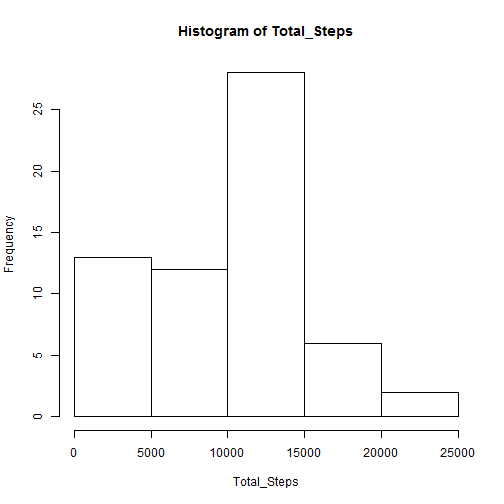
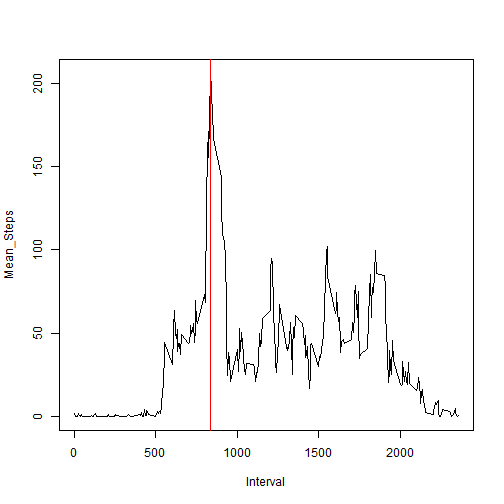
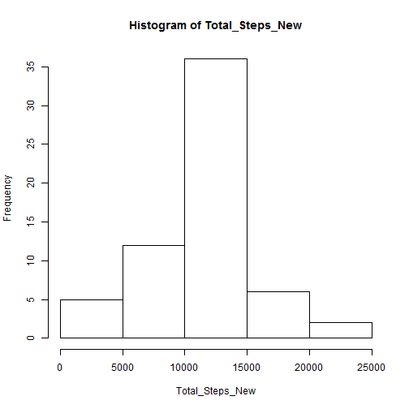
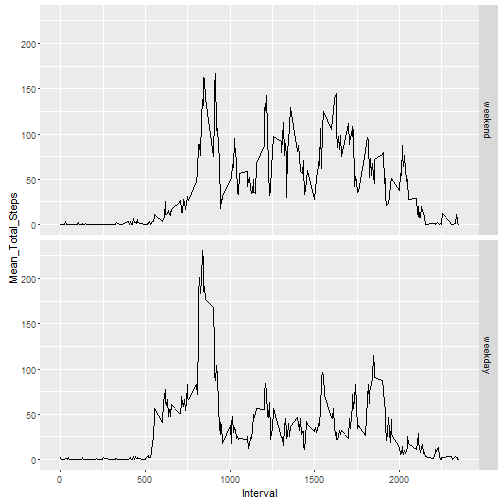

```r
## Loading and preprocessing the data

activity <- read.csv("activity.csv", header=TRUE, dec=".", comment.char="#", colClasses = c("character", "Date", "character"), na.strings = "NA")
activity$steps <- as.numeric(activity$steps)
activity$interval <- as.numeric(activity$interval)

## What is mean total number of steps taken per day?

# Calculate total steps ignoring NA values and plot histogram:
Total_Steps <- with(data=activity, tapply(steps, date, sum, na.rm=TRUE))
hist(Total_Steps)
```



```r
# Calculate the mean and median of total steps per day:
meanSteps <- mean(Total_Steps)
medianSteps <- median(Total_Steps)
print(paste("Mean total steps taken per day:", meanSteps))
```

```
## [1] "Mean total steps taken per day: 9354.22950819672"
```

```r
print(paste("Median total steps taken per day:", medianSteps))
```

```
## [1] "Median total steps taken per day: 10395"
```

```r
## What is the average daily activity pattern?

# Calculate the mean steps for each interval across days then plot it:
stepsIntv <- with(activity, tapply(steps, interval, mean, na.rm=TRUE))
stepsInInterval <- data.frame("Interval" = as.numeric(names(stepsIntv)), "Mean_Steps"=stepsIntv)
plot(x=stepsInInterval$Interval, y=stepsInInterval$Mean_Steps, type="l", xlab="Interval", ylab = "Mean_Steps")

# Find the interval with maximum steps:
maxStepInt <- stepsInInterval[stepsInInterval$Mean_Steps == max(stepsInInterval$Mean_Steps), "Interval"]
print(paste("The interval that has maximum number of steps averaged across all days is", maxStepInt, "-", (maxStepInt+5)))
```

```
## [1] "The interval that has maximum number of steps averaged across all days is 835 - 840"
```

```r
abline(v = maxStepInt, col="Red", lwd=1)
```



```r
## Imputing missing values

stepsNA <- sum(is.na(activity$steps))
dateNA <- sum(is.na(activity$date))
# All NA values are in steps field
print(paste("Number of rows having NA values is", stepsNA))
```

```
## [1] "Number of rows having NA values is 2304"
```

```r
activityFilled <- activity
for(i in 1:nrow(activityFilled)){
        if(is.na(activityFilled[i,"steps"])){
                activityFilled[i,"steps"] = stepsInInterval[stepsInInterval$Interval == activityFilled[i,"interval"] ,"Mean_Steps"]
        }
}

# Calculate total steps, mean and median with filled up missing values and a histogram plot:
Total_Steps_New <- with(activityFilled, tapply(steps, date, sum))
hist(Total_Steps_New)
```



```r
meanStepsNew <- mean(Total_Steps_New)
medianStepsNew <- median(Total_Steps_New)
print(paste("Mean total steps taken per day:", meanStepsNew))
```

```
## [1] "Mean total steps taken per day: 10766.1886792453"
```

```r
print(paste("Median total steps taken per day:", medianStepsNew))
```

```
## [1] "Median total steps taken per day: 10766.1886792453"
```

```r
# Show the change in mean, median after filling the missing values:
print("Yes mean and median values have changed.")
```

```
## [1] "Yes mean and median values have changed."
```

```r
print(paste("Mean total steps have increased by:", (meanStepsNew-meanSteps)))
```

```
## [1] "Mean total steps have increased by: 1411.95917104856"
```

```r
print(paste("Median total steps have increased by:", (medianStepsNew-medianSteps)))
```

```
## [1] "Median total steps have increased by: 371.188679245282"
```

```r
## Are there differences in activity patterns between weekdays and weekends?

# Assign weekend or weekday to each date:
activityFilled$day <- weekdays(activityFilled$date, abbreviate = TRUE)
for(i in 1:17568){
        x = activityFilled[i,"day"]
        if(x=="Sat") {y="weekend"}
        else if(x=="Sun") {y="weekend"}
        else {y="weekday"}
        activityFilled[i,"day"] = y
}

# Find mean steps for each interval for weekdays and weekend separated:
activityFilled$day <- factor(activityFilled$day, levels=c("weekend", "weekday"))
weekData <- with(activityFilled, tapply(steps, list(interval,day), mean))

# Reshaping the data frame, assigning proper name to fields and plotting the results:
library(reshape2)
weekData <- melt(weekData)
colnames(weekData) <- c("Interval", "Day", "Mean_Total_Steps")
library(ggplot2)
g <- ggplot(weekData, aes(Interval, Mean_Total_Steps)) + geom_line()
g <- g + facet_grid(Day~.)
g
```


